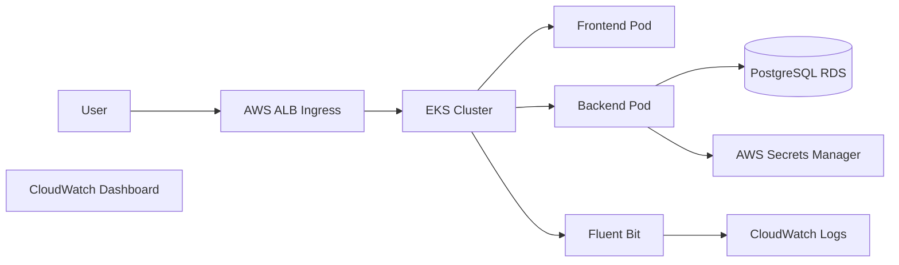

## Live Application

Frontend

http://k8s-default-alphaing-e4acd881d2-1206483414.ap-southeast-1.elb.amazonaws.com

Backend Health Check

http://k8s-default-alphaing-e4acd881d2-1206483414.ap-southeast-1.elb.amazonaws.com/api/health


The goal is to build and deploy a demo web application using:

* **Terraform** for infrastructure provisioning
* **Amazon EKS** for Kubernetes orchestration
* **Amazon RDS** for the database
* **AWS Secrets Manager** for secure credential storage
* **IRSA (IAM Roles for Service Accounts)** for secure pod access to AWS
* **GitHub Actions** for CI/CD
* **CloudWatch** for logs, metrics, and dashboards

---

# Architecture



---

# Technologies Used

### Infrastructure

* Terraform
* AWS VPC
* Amazon EKS
* Amazon RDS
* Amazon ECR
* AWS IAM (IRSA)
* AWS Secrets Manager

### Kubernetes

* AWS Load Balancer Controller
* Fluent Bit (CloudWatch logging)
* Kubernetes Deployments
* Kubernetes Services
* Kubernetes Ingress

### CI/CD

* GitHub Actions
* Docker
* Trivy container security scanning

### Observability

* Amazon CloudWatch Logs
* Amazon CloudWatch Dashboard

---

# Repository Structure

```
.
├── app
│   ├── backend
│   └── frontend
│
├── terraform
│   ├── modules
│   │   ├── vpc
│   │   ├── eks
│   │   ├── ecr
│   │   ├── rds
│   │   ├── secrets
│   │   ├── iam
│   │   ├── logging
│   │   └── dashboard
│   │
│   └── environments
│       └── dev
│
├── k8s
│   ├── backend
│   ├── frontend
│   └── ingress
│
└── .github/workflows
    └── deploy.yml
```

---

# Prerequisites

Install the following tools:

* Terraform ≥ 1.5
* AWS CLI
* kubectl
* Helm
* Docker
* Git

Configure AWS credentials:

```
aws configure
```

---

# Step 1 — Clone the Repository

```
git clone <your-repo-url>
cd alpha-devops-assignment
```

---

# Step 2 — Provision Infrastructure (Terraform)

Navigate to the Terraform environment.

```
cd terraform/environments/dev
```

Initialize Terraform:

```
terraform init
```

Preview infrastructure:

```
terraform plan
```

Apply infrastructure:

```
terraform apply
```

Terraform will create:

* VPC
* Subnets
* EKS cluster
* EKS node group
* ECR repositories
* RDS PostgreSQL database
* IAM roles (including IRSA roles)
* Secrets Manager secret
* CloudWatch log groups
* CloudWatch dashboard

---

# Step 3 — Configure kubectl for EKS

```
aws eks update-kubeconfig \
--region ap-southeast-1 \
--name alpha-devops-dev-eks
```

Verify:

```
kubectl get nodes
```

---

# Step 4 — Install Kubernetes Add-ons

## AWS Load Balancer Controller

```
helm repo add eks https://aws.github.io/eks-charts
helm repo update

helm install aws-load-balancer-controller eks/aws-load-balancer-controller \
-n kube-system \
--set clusterName=alpha-devops-dev-eks \
--set serviceAccount.create=false \
--set serviceAccount.name=aws-load-balancer-controller
```

---

## Fluent Bit (CloudWatch Logging)

```
helm repo add fluent https://fluent.github.io/helm-charts
helm repo update

helm install aws-for-fluent-bit fluent/aws-for-fluent-bit \
-n kube-system
```

Verify installation:

```
kubectl get pods -n kube-system
```

You should see pods like:

```
aws-load-balancer-controller
aws-for-fluent-bit
```

---

# Step 5 — Configure GitHub Secrets

Add these secrets in the repository settings:

```
AWS_ACCESS_KEY_ID
AWS_SECRET_ACCESS_KEY
AWS_ACCOUNT_ID
AWS_REGION
EKS_CLUSTER_NAME
ECR_BACKEND_REPO
ECR_FRONTEND_REPO
BACKEND_IRSA_ROLE
DB_SECRET_NAME
```

These secrets are used by the **GitHub Actions CI/CD pipeline**.

---

# Step 6 — Deploy the Application

Push code to the main branch.

```
git push origin main
```

The GitHub Actions pipeline will:

1. Build backend Docker image
2. Build frontend Docker image
3. Scan images using Trivy
4. Push images to Amazon ECR
5. Inject image tags into Kubernetes manifests
6. Deploy application to EKS
7. Perform health check
8. Rollback if deployment fails

---

# Step 7 — Verify Deployment

Check running pods:

```
kubectl get pods
```

Check services:

```
kubectl get svc
```

Check ingress:

```
kubectl get ingress
```

Retrieve ALB URL:

```
kubectl get ingress alpha-ingress \
-o jsonpath='{.status.loadBalancer.ingress[0].hostname}'
```

Open the URL in a browser.

---

# Application Endpoints

Frontend:

```
http://<ALB-DNS>
```

Backend Health Check:

```
http://<ALB-DNS>/api/health
```

Database Test Endpoint:

```
http://<ALB-DNS>/db
```

---

# Observability

Logs are shipped to **CloudWatch** using Fluent Bit.

Metrics are available in the **CloudWatch Dashboard**, including:

* EKS node CPU utilization
* RDS CPU utilization
* RDS database connections
* RDS storage usage

---

# Security

The backend application retrieves database credentials from **AWS Secrets Manager**.

Access is granted via **IAM Roles for Service Accounts (IRSA)**.

Benefits:

* No hardcoded credentials
* Fine-grained AWS permissions
* Secure pod identity

---

# CI/CD Pipeline Overview

```
Developer Push
      ↓
GitHub Actions
      ↓
Docker Build
      ↓
Trivy Security Scan
      ↓
Push Images to ECR
      ↓
Update Kubernetes Manifests
      ↓
Deploy to EKS
      ↓
Health Check
```

---

## Runbook

### Checking Logs

Application logs can be viewed either in **AWS CloudWatch Logs** or directly from the Kubernetes cluster.

* CloudWatch:
  Navigate to **CloudWatch → Log Groups → `/aws/eks/fluentbit-cloudwatch/logs`** to see application logs collected from the cluster.

* Kubernetes logs:

```bash
kubectl logs deployment/backend
kubectl logs deployment/frontend
```

---

### Troubleshooting Unhealthy Targets

If the application is not responding or ALB targets become unhealthy:

1. Check pod status:

```bash
kubectl get pods
```

2. Inspect a problematic pod:

```bash
kubectl describe pod <pod-name>
```

3. Verify backend health endpoint:

```text
http://<ALB-DNS>/api/health
```

4. Check logs for errors:

```bash
kubectl logs deployment/backend
```

---

### Rollback Approach

If a deployment introduces issues, Kubernetes allows quick rollback to the previous version.

Check rollout history:

```bash
kubectl rollout history deployment/backend
```

Rollback deployment:

```bash
kubectl rollout undo deployment/backend
kubectl rollout undo deployment/frontend
```

Verify rollout status:

```bash
kubectl rollout status deployment/backend
```

