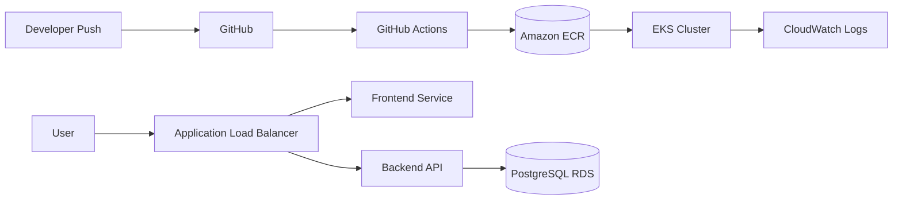

## Architecture Overview

```mermaid
flowchart LR

Dev[Developer Push] --> GitHub
GitHub --> CI[GitHub Actions]

CI --> ECR[(Amazon ECR)]
ECR --> EKS[EKS Cluster]

User --> ALB[Application Load Balancer]

ALB --> Frontend[Frontend Service]
ALB --> Backend[Backend API]

Backend --> RDS[(PostgreSQL RDS)]

EKS --> CloudWatch[CloudWatch Logs]
```