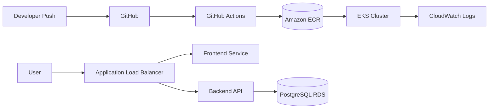

## Architecture Overview

## Live Application

Frontend

http://k8s-default-alphaing-e4acd881d2-1206483414.ap-southeast-1.elb.amazonaws.com

Backend Health Check

http://k8s-default-alphaing-e4acd881d2-1206483414.ap-southeast-1.elb.amazonaws.com/api/health

## Infrastructure

The infrastructure is deployed using Terraform on AWS.

Components:

- VPC with public and private subnets
- EKS Kubernetes cluster
- RDS PostgreSQL database
- ECR container registry
- Application Load Balancer via Kubernetes Ingress
- CloudWatch logging and monitoring
- CI/CD pipeline using GitHub Actions